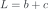
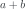
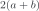
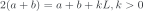
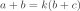
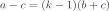
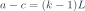

# leetcode 142 环形链表 II

在 [leetcode 141 环形链表](<./leetcode 141 环形链表.md>) 的基础上进一步操作。此时快慢两指针已经在环内某个节点重合了。现在把其中一个指针移动到开头`head`，然后两个指针同时向前进，最后一定会重合，且重合点就是环的开头。

时间复杂度是，空间复杂度是。

下面说明这种做法的正确性。我们假设从`head`到环开头的距离是 `a`，环开头到快慢指针重合点的距离是 `b`，快慢指针重合点到环开头的距离是 `c`，环的长度是 `L`。

因此：

<p align="center"></p>

快慢指针重合的时候，慢指针走的长度是：

<p align="center"></p>

因此快指针走的长度就是：

<p align="center"></p>

快指针比慢指针多走的地方就是多绕了若干圈。假设多绕了 `k` 圈，那么就有：

<p align="center"></p>

把上面两个公式联立，得到：

<p align="center"></p>

即：

<p align="center"></p>

又因为 `L = b + c`，所以：

<p align="center"></p>

这也就是说，从起点走到环开头的路程，比从指针重合点走到环开头的路程多了若干圈（`k = 1` 时相等）。这就说明，如果有一个指针从开头走，另一个从指针重合点走，它们共同走 `a` 步，最后就一定会在环开头重合。此时从重合点出发的指针多绕了 `k - 1` 圈。

```c++
class Solution {
public:
    ListNode *detectCycle(ListNode *head) {
        ListNode* fast = head, *slow = head;

        while(fast != NULL && fast->next != NULL){
            fast = fast->next->next;
            slow = slow->next;

            if(fast == slow){
                slow = head;
                while(fast != slow){
                    fast = fast->next;
                    slow = slow->next;
                }
                return fast;
            }
        }
        return NULL;
    }
};
```

