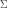

# leetcode 76 最小覆盖子串

最原始的做法就是遍历每个子串，子串数量级是，一定会超时。

那么是否可以尽量复用一次搜索的成果？比如从位置`j`开始，用另一个指针`i`从`j`开始向右前进，依次判断子串`[j, i]`，直到找到第一个合法的`i`。此时的子串`[j, i]`一定是从`j`开始的最小子串。

如果想让时间复杂度是，那么指针`i`和`j`就一定不能回头。在已知`[j, i]`的前提下，我们可以让`j`不断右移。如果`[j + k, i]`也是合法子串，那么这一定是从`j + k`开始的最小子串（如果不是的话，假如`[j + k, r]且r < i`才是最小子串，那么`[j, r]`也一定是一个合法子串，那么当时`i`遍历的时候遇到`r`肯定就停止了）。

`j`不断右移，直到`[j, i]`第一次不再是合法子串了。此时继续右移`i`，直到`[j, i]`合法再停。然后不断右移`j`。以此类推。

这样就保证了每个位置开头的最小子串都会被遍历到。

下面一个问题就是判断是否是合法子串。最好想的办法就是建立两个数组，分别统计子串和目标串`t`的各字符数量，然后按字符一一比较。这样的话时间复杂度是，其中是组成字符串的字符集的大小。

但这题使用了滑动窗口，因此可以尽量复用前一次的扫描结果。用变量`valid`实时记录子串和目标串`t`数量相等的字符的数量。如果`valid`和`t`里面的字符数量相等，就说明子串合法。移出和移入元素的时候按需操作`valid`即可。这样的时间复杂度就是了。

```c++
class Solution {
public:
    string minWindow(string s, string t) {
        unordered_map<char, int> mps, mpt;	// 分别存放子串和目标串 t 里面各字符的数量
        for(auto x: t) mpt[x] ++;
        
        int st, len = 1e9; // 最小子串的开始下标和长度
        int valid = 0;
        for(int i = 0, j = 0; i < s.size(); i ++){
            if(mpt.count(s[i])){
                mps[s[i]] ++;
                if(mps[s[i]] == mpt[s[i]]) valid ++; // 有一个字符数量已经和 t 里面的相同了
            }
            
            while(j <= i && valid == mpt.size()){ // 子串合法了
                int cur_len = i - j + 1;
                if(cur_len < len){
                    st = j, len = cur_len;
                }
                
                if(mpt.count(s[j])){	// 如果 s[j] 也是 t 里面的字符，就要把它移除出统计范围
                    mps[s[j]] --;
                    if(mps[s[j]] < mpt[s[j]]) valid --;
                }
                j ++;
            }
        }
        if(len == 1e9) return "";
        else return s.substr(st, len);
    }
};
```


